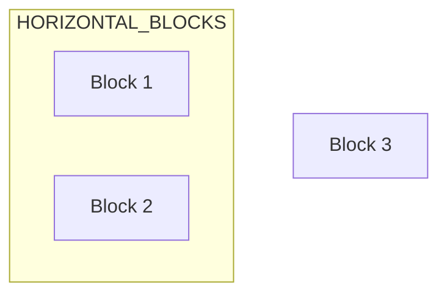

```mermaid
flowchart TD
  %% Define blocks
  block1["Block 1"]
  block2["Block 2"]
  block3["Block 3"]

  %% Use subgraph to enforce horizontal layout for block1 and block2
  subgraph HORIZONTAL_BLOCKS
    direction LR
    block1
    block2
  end

  %% Place block3 below the horizontal blocks (no connections)
  block3
```
