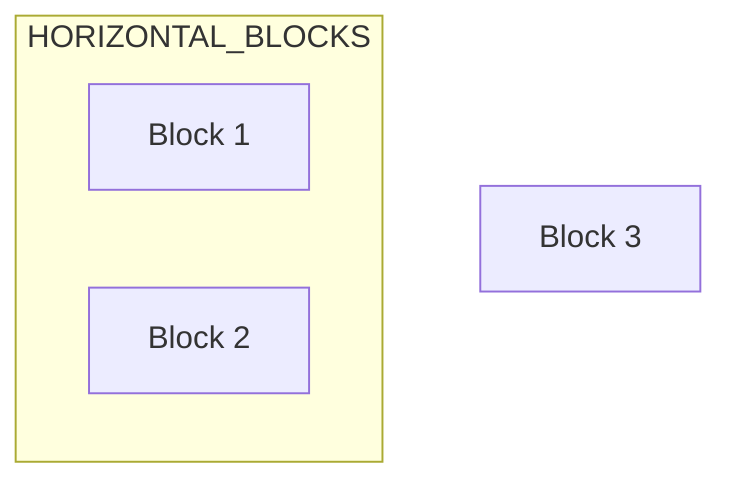

```mermaid
flowchart TD
  %% Define blocks
  A["Block 1"]
  B["Block 2"]
  C["Block 3"]

  %% Use subgraph to enforce horizontal layout for block1 and block2
  subgraph HORIZONTAL_BLOCKS
    direction LR
    A
    B
  end

  %% Place block3 below the horizontal blocks (no connections)
  C
```

